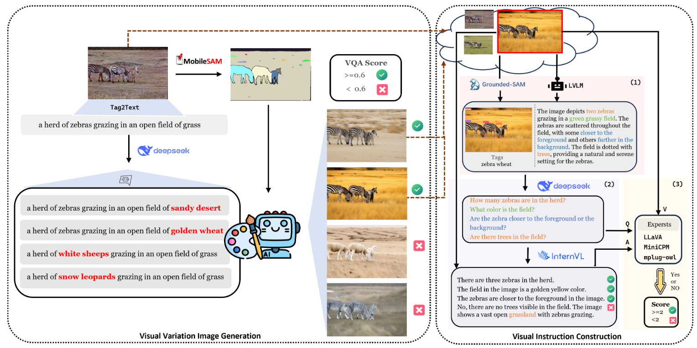

# [ACM MM25] See Different, Think Better: Visual Variations Mitigating Hallucinations in LVLMs

## Overview

This repository contains the implementation code for the paper:
See Different, Think Better: Visual Variations Mitigating Hallucinations in LVLMs

The dataset is in https://www.modelscope.cn/datasets/oliviadzy/ViHallu-Instruction



The ViHallu framework consists of two main processes:
1. **Visual Variation Image Generation**: Generate diverse visual variations while assessing quality
2. **Visual Instruction Construction**: Build detailed captions and quality assessments through multimodal understanding

## Architecture Overview

```
Input Image
    ↓
[MobileSAM] → Segmentation Mask
    ↓
[DeepSeek LLM] → Caption Editing (Concept Substitution)
    ↓
[ControlNet Union] → Visual Variation Generation with Quality Assessment (VQA Score)
    ↓
[GroundingDINO + InternVL] → Detailed Caption & Object QA Pair Generation
    ↓
Output: Visual Instructions with Hallucination Labels
```

## Installation


### Step 1: Clone and Setup

```bash
# Clone this repository
git clone https://github.com/oliviadzy/ViHallu.git
cd ViHallu

# Create virtual environment
python -m venv venv
source venv/bin/activate  # On Windows: venv\Scripts\activate
```

### Step 2: Install Core Dependencies

```bash
pip install -r requirements.txt
```

### Step 3: Install External Repositories

This project depends on several external repositories. Install them in the following order:

#### 1. GroundingDINO - Object Detection
```bash
git clone https://github.com/IDEA-Research/GroundingDINO.git
cd GroundingDINO
pip install -e .
cd ..
```
**Citation**: Used in `groundingdino_wrapper.py` for object detection

#### 2. Diffusers with ControlNet Union Support
```bash
# Install from source to get latest ControlNet Union support
pip install git+https://github.com/huggingface/diffusers.git
```
**Citation**: Used in `controlplus_generate_image.py`
- **Models**:
  - ControlNet Union SDXL: `xinsir/controlnet-union-sdxl-1.0`
  - Stable Diffusion XL Base: `stabilityai/stable-diffusion-xl-base-1.0`
  - VAE: `madebyollin/sdxl-vae-fp16-fix`

#### 3. ControlNet Auxiliary - Image Processing
```bash
pip install controlnet-aux
```
**Citation**: Used in `controlplus_generate_image.py` (MobileSAM for segmentation)

#### 4. InternVL - Vision-Language Model
```bash
git clone https://github.com/OpenGVLab/InternVL.git
cd InternVL
pip install -e .
cd ..
```
**Citation**: Used in `internvl_generate_answers.py`
- **Model**: `OpenGVLab/InternVL2-26B` (requires ~26GB VRAM for inference)

#### 5. DeepSeek API - LLM-based Caption Editing
```bash
pip install openai
```
**Citation**: Used in `generate_verification_questions.py` for caption editing
- **API**: https://api.deepseek.com

### Step 4: Environment Configuration

Set the following environment variables:

```bash
# DeepSeek API Key (required for caption editing)
export DEEPSEEK_API_KEY="your-api-key-here"

# Model paths (optional, defaults provided in code)
export INTERNVL_MODEL_PATH="/path/to/InternVL2-26B"
export INTERNVL_IMAGE_FOLDER="/path/to/dataset/images"
export INTERNVL_INPUT_JSON="input_questions.json"
export INTERNVL_OUTPUT_JSON="results_with_answers.json"
```

## Project Structure

```
ViHallu/
├── README.md
├── requirements.txt
├── controlplus_generate_image.py       # Step 1: Visual variation generation
├── generate_verification_questions.py  # Step 2: Caption editing with DeepSeek
├── groundingdino_wrapper.py           # Step 3a: Object detection wrapper
├── internvl_generate_answers.py        # Step 3b: Visual QA generation
├── models/
│   └── controlnet_union.py            # ControlNet Union model
├── pipeline/
│   └── pipeline_controlnet_union_sd_xl.py  # Custom SDXL pipeline
└── data/
    ├── input/                         # Input images and captions
    └── output/                        # Generated images and results
```

## Usage Guide

### Step 1: Visual Variation Image Generation

This step generates diverse visual variations of input images with quality assessment using ControlNet Union.

```bash
python controlplus_generate_image.py
```

**Configuration** (edit in `controlplus_generate_image.py`):
```python
input_image_folder = "/path/to/input/images"
output_image_folder = "/path/to/output/images"
json_file_path = "/path/to/captions.json"
results_json_path = "/path/to/results.json"
```

**Input JSON format** (`captions.json`):
```json
[
  {
    "image": "zebras_001.jpg",
    "rewritten_captions": [
      "a herd of zebras grazing in an open field of sandy desert",
      "a herd of zebras grazing in an open field of golden wheat",
      "a herd of white sheeps grazing in an open field of grass"
    ]
  },
  {
    "image": "zebras_002.jpg",
    "rewritten_captions": [...]
  }
]
```

**Features**:
- Uses **MobileSAM** for semantic segmentation
- Applies **ControlNet Union** for condition-guided generation
- Performs **VQA (Visual Quality Assessment)** filtering (threshold: 0.6)
- Supports batch processing with progress tracking
- Generates images at 1024x1024 resolution

**Output JSON format** (`results.json`):
```json
[
  {
    "image_filename": "/path/to/output/zebras_001_sandy_0.jpg",
    "prompt": "a herd of zebras grazing in an open field of sandy desert"
  },
  ...
]
```

**GPU Usage**: ~8GB VRAM (can be reduced with `num_inference_steps=20`)

---

### Step 2: Caption Editing and Concept Substitution

Generate multiple caption variations using DeepSeek LLM for concept substitution.

```bash
# Set your DeepSeek API key first
export DEEPSEEK_API_KEY="sk-xxxxxxxxxxxx"

python generate_verification_questions.py
```

**Configuration** (edit in `generate_verification_questions.py`):
```python
input_data = read_json('/path/to/output_split.json')
output_path = '/path/to/qwen_eval_ds_question.json'
```

**Input JSON format**:
```json
[
  {
    "answer": "a herd of zebras grazing in an open field of grass"
  },
  ...
]
```

**Key Features**:
- Performs concept substitution in captions
- Generates verification questions (≤20 words each)
- Supports streaming responses
- Saves results incrementally to prevent data loss

**Output JSON format**:
```json
[
  {
    "answer": "a herd of zebras grazing in an open field of grass",
    "response": "& How many zebras are in the herd?\n& What color is the field?\n& Are the zebras grazing?"
  },
  ...
]
```

**API Costs**: Varies by number of captions (typically $0.001-0.01 per request)

---

### Step 3a: Object Detection (GroundingDINO)

Detect objects in images using text prompts.

**Code example**:
```python
from groundingdino_wrapper import load_model, predict

# Load model
model = load_model(
    config_path="groundingdino_swint_ogc.py",
    model_path="groundingdino_swint_ogc.pth"
)

# Predict
boxes, logits, phrases = predict(
    model=model,
    image_path="path/to/image.jpg",
    prompt="zebra",
    box_threshold=0.35,
    text_threshold=0.25
)

# Results
print(f"Found {len(boxes)} objects")
# boxes: tensor of bounding boxes [x1, y1, x2, y2]
# logits: confidence scores for each detection
# phrases: detected object names
```

**Parameters**:
- `box_threshold`: Confidence threshold for bounding boxes (default: 0.35)
- `text_threshold`: Confidence threshold for text matching (default: 0.25)

**GPU Usage**: ~4GB VRAM

---

### Step 3b: Visual Question Answering (InternVL)

Generate answers to visual questions using InternVL2-26B.

```bash
export INTERNVL_MODEL_PATH="/path/to/InternVL2-26B"
export INTERNVL_IMAGE_FOLDER="/path/to/images"
export INTERNVL_INPUT_JSON="questions.json"
export INTERNVL_OUTPUT_JSON="answers.json"

python internvl_generate_answers.py
```

**Configuration** (via environment variables):
```bash
INTERNVL_MODEL_PATH="/data/dzy/MLLM/OpenGVLab/InternVL2-26B"
INTERNVL_IMAGE_FOLDER="/data/dzy/MLLM/dataset/cc_sbu_align/image"
INTERNVL_INPUT_JSON="cleaned_question.json"
INTERNVL_OUTPUT_JSON="results_with_answers.json"
```

**Input JSON format** (`questions.json`):
```json
{
  "annotations": [
    {
      "Image ID": "image001",
      "Processed Question": "What color is the field?"
    },
    {
      "Image ID": "image002",
      "Processed Question": "How many zebras are in the herd?"
    }
  ]
}
```

**Output JSON format** (`answers.json`):
```json
{
  "results": [
    {
      "Image ID": "image001",
      "Processed Question": "What color is the field?",
      "Answer": "The field is a golden yellow color..."
    },
    {
      "Image ID": "image002",
      "Processed Question": "How many zebras are in the herd?",
      "Answer": "There are three zebras visible in the herd..."
    }
  ]
}
```

**Features**:
- Supports dynamic image preprocessing for variable aspect ratios
- Generates up to 50 tokens per answer
- Processes multiple images with progress tracking

**GPU Usage**: ~26GB VRAM (for InternVL2-26B)

---

## Complete End-to-End Pipeline

Run the complete pipeline in sequence:

```bash
# 1. Generate visual variations with quality assessment
echo "Step 1: Generating visual variations..."
python controlplus_generate_image.py

# 2. Edit captions using DeepSeek
echo "Step 2: Editing captions with concept substitution..."
python generate_verification_questions.py

# 3. Perform object detection on generated images
echo "Step 3a: Detecting objects..."
python -c "
from groundingdino_wrapper import load_model, predict
import os

model = load_model()
for img_file in os.listdir('output/'):
    if img_file.endswith('.jpg'):
        boxes, logits, phrases = predict(model, image_path=f'output/{img_file}', prompt='objects')
        print(f'Detected {len(boxes)} objects in {img_file}')
"

# 4. Generate visual QA pairs
echo "Step 3b: Generating visual QA pairs..."
python internvl_generate_answers.py

echo "Pipeline complete! Results saved to output/"
```


## Citation

If you find this work helpful in your research, please cite our paper:

```bibtex
@inproceedings{dai2025see,
  title={See Different, Think Better: Visual Variations Mitigating Hallucinations in LVLMs},
  author={Dai, Ziyun and Li, Xiaoqiang and Zhang, Shaohua and Wu, Yuanchen and Li, Jide},
  booktitle={Proceedings of the 33rd ACM International Conference on Multimedia},
  pages={3310--3319},
  year={2025}
}
```


## Acknowledgments

We thank the authors and maintainers of the following projects:
- [GroundingDINO](https://github.com/IDEA-Research/GroundingDINO) - Object detection
- [ControlNet Union](https://huggingface.co/xinsir/controlnet-union-sdxl-1.0) - Conditional image generation
- [InternVL](https://github.com/OpenGVLab/InternVL) - Vision-language understanding
- [Diffusers](https://github.com/huggingface/diffusers) - Diffusion models
- [DeepSeek](https://api.deepseek.com) - LLM services

## Contact & Support

For questions, issues, or collaborations, please:
- Open an issue on [GitHub](https://github.com/oliviadzy/ViHallu/issues)
- Contact the authors directly

---

**Last Updated**: November 2025  
**Repository**: [oliviadzy/ViHallu](https://github.com/oliviadzy/ViHallu)
